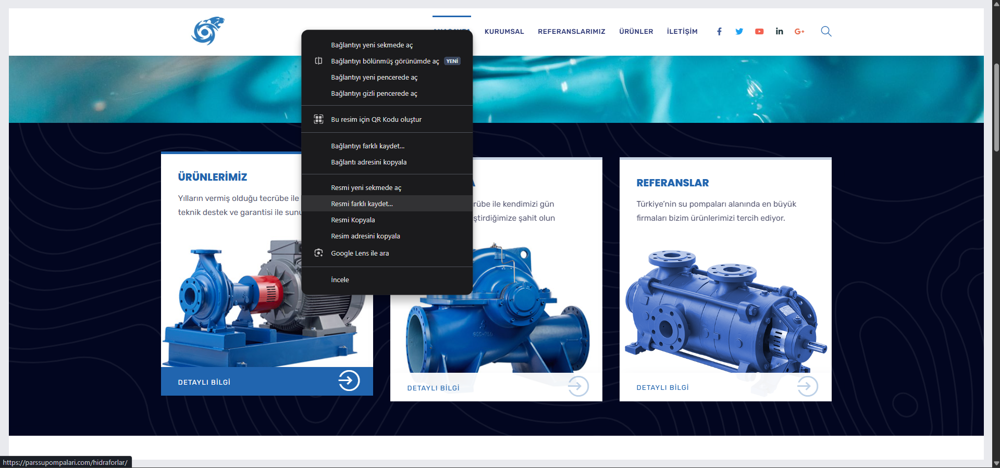
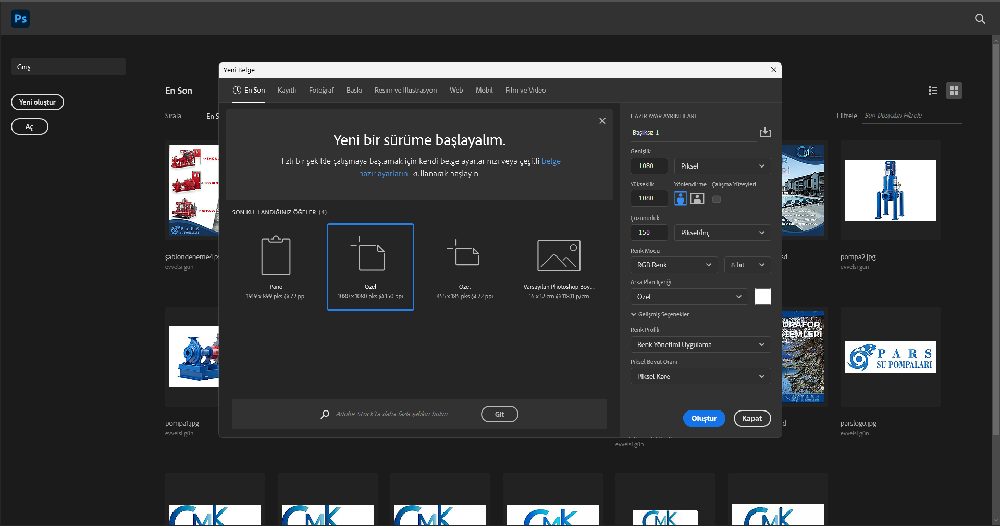
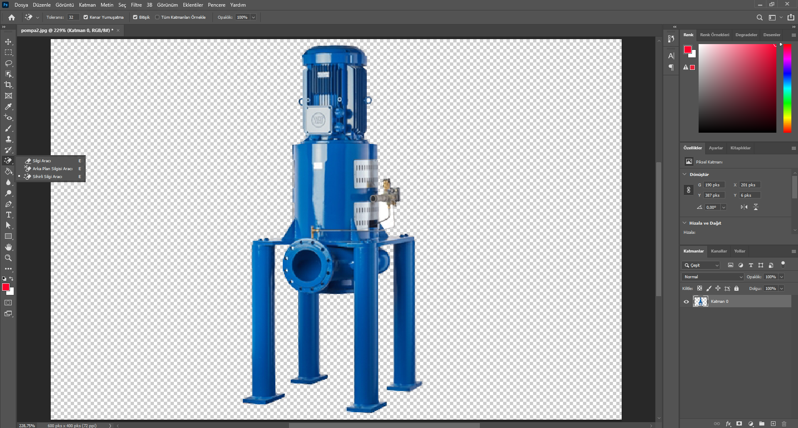
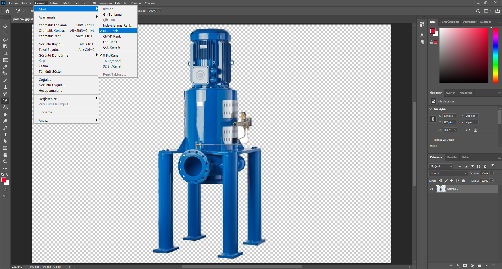
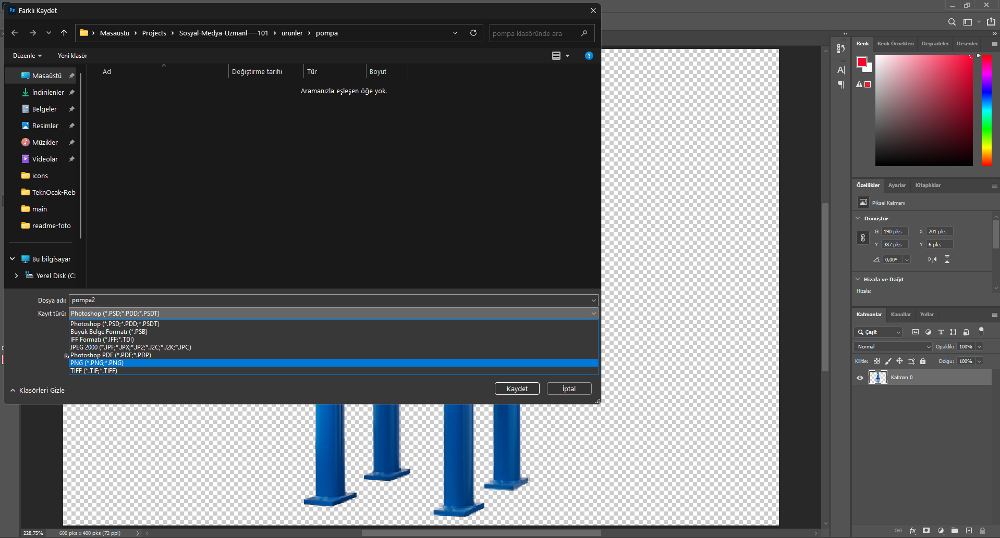
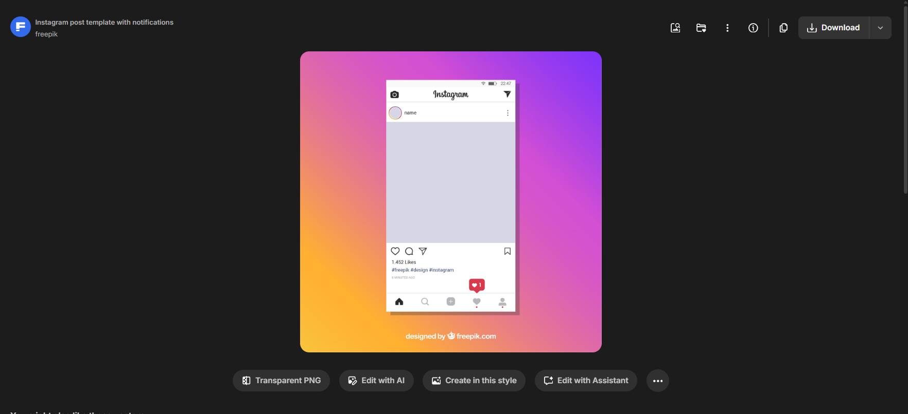
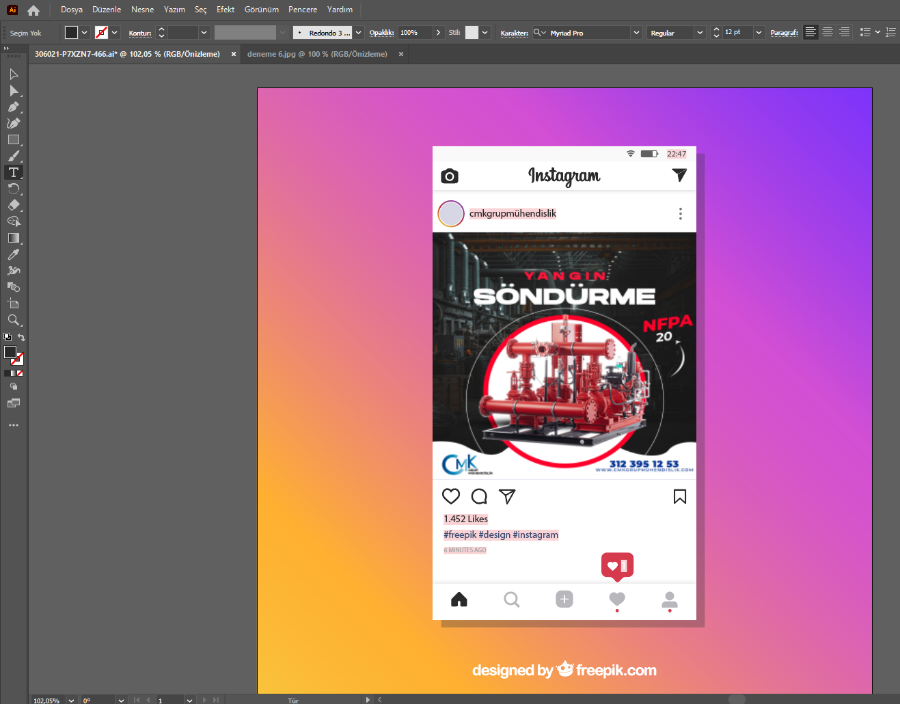

# 📱 Sosyal Medya İçerik Üretimi & Tasarım Rehberi

Bu rehber, sosyal medya uzmanlığı yolunda görsel tasarım süreçlerini, teknik detayları ve ipuçlarını içerir. İşinize yarıyacak hata çözümleri ve ilgili web siteleri tavsiyeleri sizi bu konuda bir adım ileriye taşıyacaktır. 

---

## 🛠️ İhtiyacımız Olan Araçlar

| Program | Kullanım Amacı |
| :--- | :--- |
| **Photoshop** | Fotoğraf düzenleme işlemleri için. |
| **Illustrator** | Vektörel çizimler ve Yapay Zeka desteği için. |
| **After Effects** | Hareketli grafikler ve video kurgu işleri için. |

---

## 📂 Örnek Çalışmalar
Aşağıda bu rehber kullanılarak oluşturulmuş bazı şablon örneklerini görebilirsiniz:

  
  
  
  
  
  
  

---

## 📸 Bölüm 1: İlgili Görselleri Temin Etmek

Ürünlerin stok fotoğraflarını indirmek için iki temel yöntem vardır:

1.  **Doğrudan Kayıt:** İlgili fotoğraflara sağ tıklayıp `Resmi Farklı Kaydet` diyerek indirebilirsiniz.
2.  **Kaynak Kod İle (Inspect):** Sağ tıklayıp `İncele (Inspect)` diyerek sitenin kaynak kodlarından görsel linkini bulabilirsiniz.

> [!WARNING]
> Bazı web sitelerinin logoları veya görselleri tamamen kodlarla (CSS) yapılmış olabilir. Bu durumda görsel olarak indirme yapılamaz, ekran görüntüsü veya SVG export gerekebilir.

  

---

## 🎨 Bölüm 2: Photoshop Hazırlığı ve Kurulum

Standart bir Instagram gönderisi için tuval ayarları kritik önem taşır.

* **Genişlik:** 1080px
* **Yükseklik:** 1080px (Kare form)
* **Çözünürlük (DPI):** 150 (Web için 72 yeterlidir ama 150 daha net sonuç verir)
* **Renk Modu:** RGB (Dijital ekranlar için)

  

---

## ⚠️ Bölüm 3: Sık Karşılaşılan Hatalar ve Çözümleri

### 1. Arka Plan Temizleme (Dekupe)
İndirdiğiniz fotoğraflar genellikle şeffaf (PNG) değildir.
* **Çözüm:** Photoshop'ta görseli açın > **Sihirli Silgi Aracı (Magic Eraser Tool)** seçin > Arka plana bir kez tıklayın.

  

### 2. Kaydetme Formatı Sorunu (RGB vs CMYK)
Arka planı silseniz bile bazen PNG olarak kaydedemezsiniz. Bunun sebebi renk modudur.

> [!TIP]
> **CMYK**, baskı içindir ve şeffaflığı desteklemez. Dosyanızı **RGB** moduna çevirmeden PNG (şeffaf) çıktı alamazsınız.

  

### 3. Doğru Kaydetme (Export)
Dosyalarınızı yönetmek için kısayolları kullanın:
* `Dosya > Farklı Kaydet`
* Kısayol: `CTRL + Shift + S`

  

Eğer bunu yapmanıza rağmen resim formatında kaydedemiyorsanız:

* `Dosya > Bir Kopyayı Kaydet`
* Kısayol: `ALT + CTRL + S`

## ⚠️ Bölüm 4: Hazır Asetler ve Resimler Bulma, Düzenleme ve Uyarlama

Tasarımların tamamı sizin elinizden çıkmak zorunda değil. Esinlenmek bu işin üretim hızını önemli ölçüde arttıracağı gibi, ürünlerin belirli bir kalite standartını yakalamasını sağlayacaktır.

### 1. Kaliteli Resim Bulma ve İndirme

Bir çok resim paylaşan web sitesi var fakat çoğu para ödemenizi ister. İşte tasarımcılar tarafından sıkça kullanılan stok resim paylaşma ve daha fazlası için indirme siteleri:

* **Unsplash:** `unsplash.com` : Stok Resimler.
* **Svgl:** `svgl.app` : Logo bulma.
* **Freepik:** `freepik.com` : Stok Resimler, Asetler, AI ile üretim.
* **Pexels:** `pexels.com` : Sadece fotoğraf değil, telifsiz **video** bulmak için de harikadır.
* **Flaticon:** `flaticon.com` : Tasarımlarınız için PNG veya SVG formatında **ikonlar** (simgeler).
* **Google Fonts:** `fonts.google.com` : Türkçe karakter destekli yüzlerce ücretsiz font.

### 2. Lisans ve Telif Hakkı Uyarısı
Her indirdiğiniz görseli ticari bir işte (bir müşterinin hesabında) kullanamazsınız.

> [!IMPORTANT]
> **Creative Commons (CC0)** lisansına sahip görselleri rahatça kullanabilirsiniz. Ancak Freepik gibi sitelerde "Attribution Required" (Atıf Gerekli) uyarısı varsa veya "Premium" lisanslıysa, lisansını satın almadan ticari kullanımı başınızı ağrıtabilir.

## 🔄 Aset Dönüşüm Tablosu (Öncesi & Sonrası)

Aşağıdaki tabloda, internetten bulunan ham stok görsellerin (sol) tarafımdan nasıl düzenlenerek nihai sosyal medya tasarımına (sağ) dönüştürüldüğü gösterilmektedir.

| 📂 Kaynak Dosya (Ham Aset) | 🎨 Benim Tasarımım (Final Hali) |
| :---: | :---: |
| **Örnek 1: Konsept Aşaması** | **Sonuç: Yayına Hazır** |
|  |  |
| **Örnek 2: Konsept Aşaması** | **Sonuç: Yayına Hazır** |
|  |  |
| **Örnek 3: Konsept Aşaması** | **Sonuç: Yayına Hazır** |
|  |  |

> [!NOTE]
> Soldaki görseller **Freepik/Unsplash** kaynaklı ham materyallerdir. Sağdaki tasarımlarda benim yaptığım renk düzeltme, tipografi, dekupe ve kompozisyon işlemleri uygulanmıştır.

---

## 📲 Bölüm 5: Mockup ile Sunum (Müşteriyi Etkileme Sanatı)

Tasarımı sadece "jpeg" olarak atmak yerine, instagram gönderisi şeklinde nasıl duracağını göstermek profesyonelliğinizi artırır. Buna **Mockup** denir.

**Nasıl Yapılır?**
1.  Google'da "İnstagram Post PSD Mockup Free" gibi aramalar yapın.
2.  İndirdiğiniz PSD dosyasını açın.
3.  Genellikle `Put Your Design Here` (Tasarımını Buraya Koy) yazan Akıllı Nesneye (Smart Object) çift tıklayın.
4.  Açılan yeni sekmeye kendi tasarımınızı koyun ve kaydedin (`CTRL + S`).

  
  

---

## 🎬 Bölüm 6: Video ve Reels İçerikleri (After Effects & Premiere)

Instagram algoritması artık videoları (Reels) fotoğraflardan daha fazla öne çıkarıyor.

### Video Ayarları (9:16 Formatı)
Reels ve TikTok için çalışma alanı ayarları şöyledir:

| Ayar | Değer |
| :--- | :--- |
| **Genişlik (Width)** | 1080 px |
| **Yükseklik (Height)** | 1920 px |
| **En Boy Oranı (Önemli)** | 9:16 |
| **Kare Hızı (FPS)** | 30 veya 60 (Akıcılık için 60 önerilir) |
| **Süre** | 5sn - 90sn arası olmalı |

> [!TIP]
> Videolarınızı render alırken (çıktı alırken) **H.264** formatını (mp4) seçin ve Bitrate değerini **10-15 Mbps** arasında tutun. Bu, Instagram'ın videonuzu yüklerken kalitesini düşürmesini engeller.

> [!NOTE]
> Video düzenleme programı konusunda illaki **After Efects** kullanmak zorunda değilsiniz. Size uygun kullanması basit bir program, işinizi fazlasıyla görecektir. Örneğin **Movavi**, **Sony Vegas Pro** aklıma ilk gelenler.

---

## 🎬 Bölüm 8: Video ve Reels Kurgusu

> [!CAUTION]
> **🚧 Bu Bölüm Yapım Aşamasındadır**
>
> Video içerikleri artık fotoğraflardan daha fazla erişim alıyor. Çok yakında buraya;
> * **After Effects & Premiere Pro** entegrasyonu,
> * Viral Reels videoları için 9:16 kurgu mantığı,
> * Müzik senkronizasyonu ve "Safe Zone" (Güvenli Alan) ayarları eklenecektir.
>
> Takipte kalın!